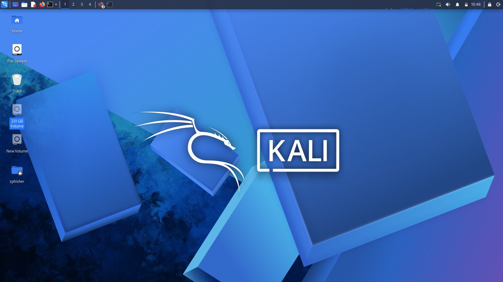
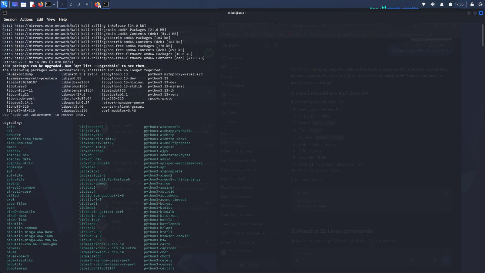
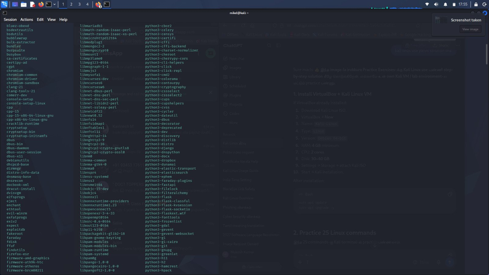
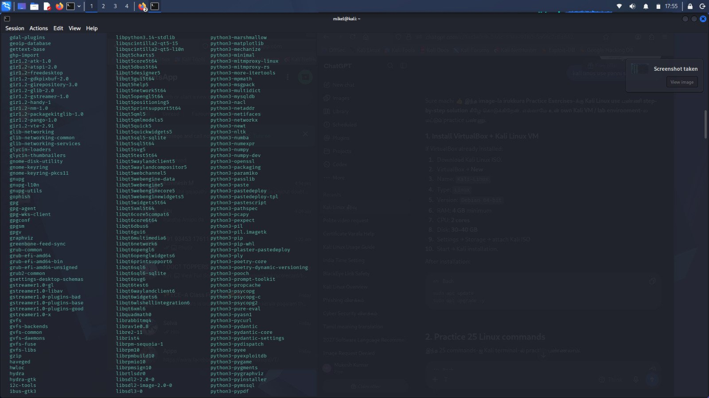
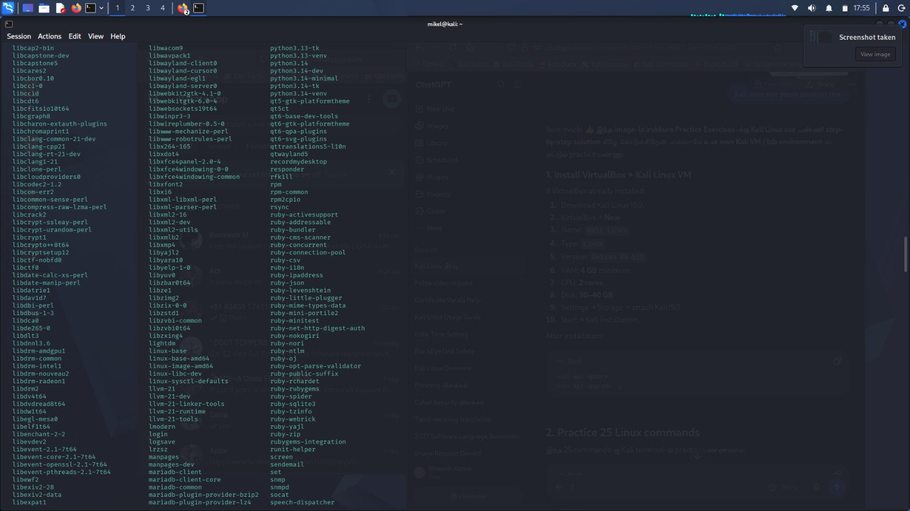
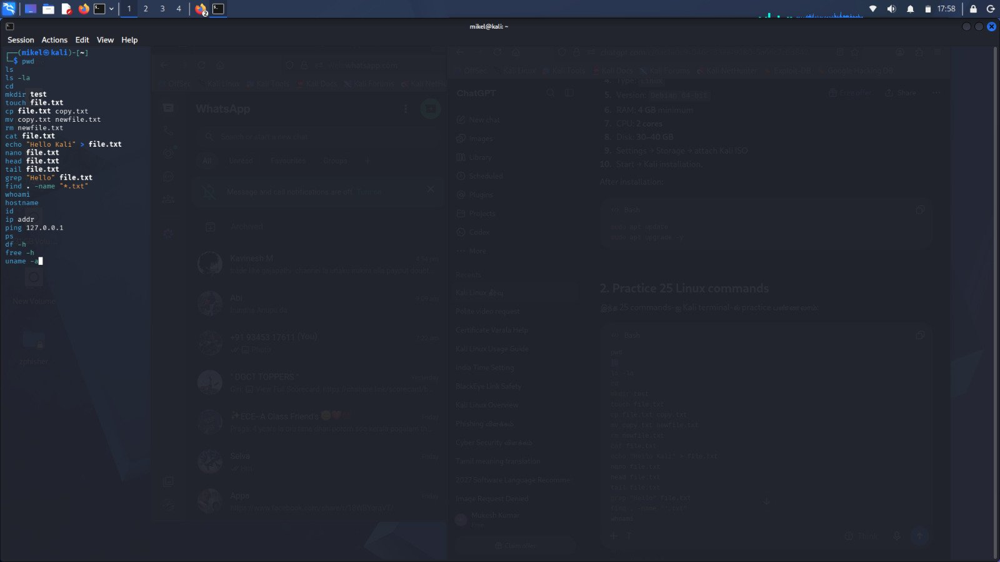
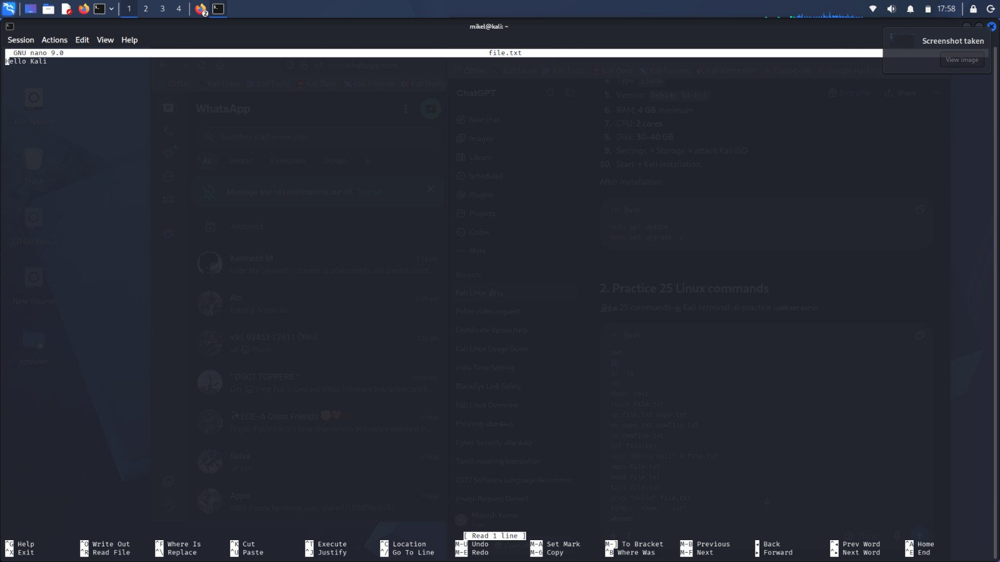
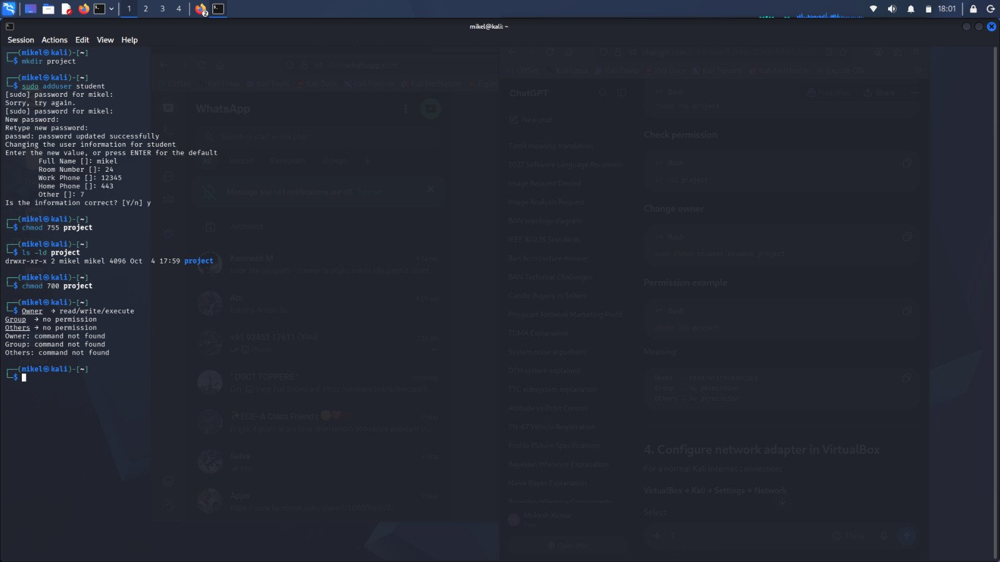
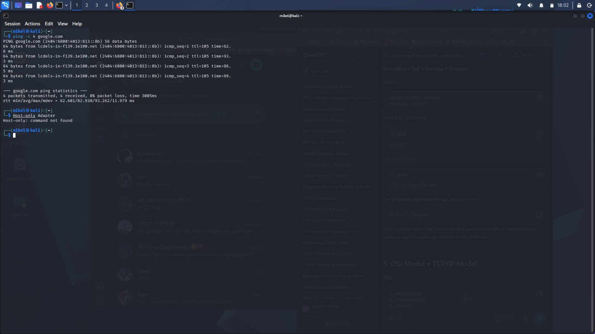

# Cybersecurity — My Kali Linux Practice

My cybersecurity learning notes, starting with hands-on practice in my own Kali Linux lab (VirtualBox VM).

## Thoughts on this practice

**Start with the basics, in a safe lab.** Everything here was done in my own Kali VM / lab environment — that's the right place to practice. Set up VirtualBox, install Kali, give it enough RAM/CPU/disk, run `sudo apt update` and upgrade, and only then start working. My update check showed a lot of packages waiting to be upgraded (1,381) — lesson one for cybersecurity: *patch first*. An out-of-date system is the easiest target.

**Terminal fluency is the foundation.** Before any “hacking” tools, I practiced 25 basic Linux commands until they felt normal:
`pwd`, `ls -la`, `cd`, `mkdir`, `touch`, `cp`, `mv`, `rm`, `cat`, `echo`, `nano`, `head`, `tail`, `grep`, `find`, `whoami`, `hostname`, `id`, `ip addr`, `ping`, `ps`, `df -h`, `free -h`, `uname -a`.
If you can't move around a system, read files, and check who you are and what's running, you can't secure it — or investigate it.

**Files and a lab folder.** I made a `test` folder, worked with `file.txt` (“Hello Kali”), then a dedicated `~/cyberlab` folder with `test.txt` reading “Kali Linux Lab”. Keeping practice in one lab folder keeps experiments tidy and easy to delete.

**Users and permissions matter most.** Creating a second user (`student`) and changing permissions on a `project` folder taught me more than it looked like:
- `chmod 755 project` → owner can read/write/execute, group and others can only read/execute (`drwxr-xr-x`)
- `chmod 700 project` → owner only, group and others get *no permission*

That's the principle of least privilege in one command. I also learned the funny way that `Owner`, `Group` and `Others` are *concepts, not commands* — typing the explanation into the terminal just gives “command not found”.

**Networking: NAT vs Host-only.** For a normal Kali internet connection in VirtualBox, NAT works — my `ping -c 4 google.com` came back 4/4, 0% packet loss. For a closed cybersecurity lab, a Host-only adapter is better: Kali and the other lab VMs can talk to each other without exposing the lab directly to the internet. Knowing *which network your VM is on* is a security decision, not just a setting.

**Next in my notes:** the OSI model and the TCP/IP model — how data actually moves — because most attacks and defences make sense once you know which layer you're looking at.

## Photos — Kali Linux practice

Screenshots from this practice session, in order:

1.  — Kali desktop, ready to work
2.  — `apt update` — 1,381 packages can be upgraded
3.  — the upgradable list, continued
4.  — upgradable packages, G–L
5.  — upgradable packages, L–S
6.  — practicing file, user and system commands in the terminal
7.  — `nano file.txt` — “Hello Kali”
8.  — creating `~/cyberlab` and `test.txt`
9.  — `sudo adduser student`, `chmod 755` then `chmod 700` on `project`
10.  — `ping -c 4 google.com` (0% loss) and VirtualBox network adapter notes

*Practice done in my own lab environment for learning.*
